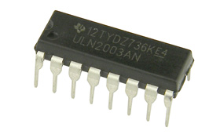

# Girassolar
Sistema de otimização do posicionamento de painéis solares, projeto final da disciplina de Microcontroladores e Aplicações DC/UFSCar.

O Girassolar é um sistema que otimiza a posição de um painel solar, com o objetivo de maximizar a eficiência energética do painel. O projeto utiliza um motor de passo para controlar a posição do painel, um relé para ativar ou desativar o output do painel, um sensor de luz para identificar a posição do sol, um display LCD para exibir informações do sistema e um botão para desativar o sistema. Além disso, utilizamos um servidor web hosteado no edison para exibir as informações do sistema utilizando a plataforma [freeboard](http://www.freeboard.io).

Esse projeto foi desenvolvido pelos alunos do curso de Engenharia de Computação da UFSCar, **Matheus Bachetti Vervloet** (495735) e **Eduardo Augusto Marinho** (495808).

   

#Vídeo

#Esquemático
Esquemático do projeto feito utilizando o site [schematics.com](http://schematics.com).  Link para projeto: [Girassolar V3](http://schematics.com/project/girassolar-v3-24773/).  
Os objetos utilizados foram criados manualmente com as ferramentas do site para representarem o mais próximo possível a realidade.

#Implementação
O projeto foi implementado utilizando o [Intel Edison](http://www.intel.com/content/www/us/en/do-it-yourself/edison.html), o [Starter Kit do Grove](http://www.seeedstudio.com/wiki/Grove_-_Starter_Kit_v3), um Stepper Motor(PM55L) e o ULN2003A para interface com o Stepper Motor e uma fonte externa(5V 3A fixo) para alimentação do motor.

#Componentes
###LCD
  
Utilizamos o LCD do Starter Kit do Grove, para controle utilizamos a biblioteca [pyupm_i2clcd](http://iotdk.intel.com/docs/master/upm/python/pyupm_i2clcd.html).  
[Exemplo de uso](https://github.com/matheusvervloet/girassolar/blob/master/Exemplos/lcd.py)  
[Exemplo de uso com sensor de luz](https://github.com/matheusvervloet/girassolar/blob/master/Exemplos/lcd_lightsensor.py)

###Relay
  
Utilizamos o relay do Starter Kit do Grove para cortar o fornecimento do painel solar, para controle utilizamos a biblioteca [pyupm_grove](http://iotdk.intel.com/docs/master/upm/python/pyupm_grove.html).  
[Exemplo de uso](https://github.com/matheusvervloet/girassolar/blob/master/Exemplos/relay.py)

###Botão
  
Botão simples do Starter Kit do Grove.

###Sensor de Luz
   
Sensor de luz do Starter Kit do Grove, utilizado para encontrar a direção da fonte de luz mais forte e então apontar o painel solar para ela. Para controle utilizamos a biblioteca [mraa.Aio](http://iotdk.intel.com/docs/master/mraa/python/mraa.html#aio).  
[Exemplo de uso](https://github.com/matheusvervloet/girassolar/blob/master/Exemplos/lightsensor.py)  

###Painel Solar
  
Utilizamos em nosso projeto um painel solar de modelo XH-45X80 comprado na [internet](http://produto.mercadolivre.com.br/MLB-719883692-celula-painel-para-energia-solar-fotovoltaica-_JM).

O painel solar tem potência máxima de saída de 0,4W, tensão máxima de funcionamento de 2V e corrente de carga maxima de 200mA, com uma eficiência da célula de 16.5%.

Para realizar a leitura do painel, o conectamos em um relay para ativar ou desativar a alimentação, e em seguida o conectamos diretamente em uma das entradas analógicas. A entrada analógica lê um sinal de até 5V e a tensão máxima do painel é de 2V.

###Stepper Motor
  
Para a movimentação da haste com o painel solar, utilizamos um motor de passo unipolar de modelo PM55L.

Para o controle do motor, usamos um CI ULN2003A, que é um conjunto de transistores darlington que são utilizados para o controle de sistemas de potência. Usamos esses transistores pois o motor pode requerir uma corrente maior do que nossa placa pode suportar. Assim, o motor é conectado à uma fonte de 5V externa, e ativado ou desativado pelos transistores.

A biblioteca 'pyupm_uln200xa' do python já inclui todos os métodos necessários para controlar o motor. Ele é inicializado com um número de passos total, em nosso caso 94, pode ter sua velocidade configurada e dar passos no sentido horário ou anti-horário.

###ULN2003A
  
CI para interface com Stepper Motor do Laboratório 1 do Departamento de Computação.  
#####Pinout
  

#Interface
Para acessar os dados do sistema em outras plataformas, utilizamos um servidor web hosteado na Edison com a plataforma [freeboard](http://freeboard.io).

A plataforma freeboard nos permite monitorar sistemas IoT em tempo real, utilizando diversos métodos de captura de dados. Em nosso sistema, o servidor e programa controlador são executados em paralelo. O programa controlador (girassolar.py) grava as informações atuais em arquivos de texto, que são então lidos pelo servidor (webserver.py) e exibidos na página.

Para utilizar o freeboard, baixamos o esqueleto estático disponível gratuitamente no site da plataforma, e o configuramos para nosso sistema. No sistema, esse esqueleto fica salvo em uma pasta '/static', onde também se encontra a configuração da interface (gira_dash.json), que é carregado automáticamente quando acessamos a página. Não disponibilizamos a '/static' em nosso github por questões de licensa, mas ela não foi modificada em nosso projeto e pode ser baixada no site indicado anteriormente.

Para acessar a página, conectamos o Intel Edison à rede local, e acessamos a página pelo IP designado à placa pelo DHCP.

`http://200.18.97.122/static/index.html#source=gira_dash.json`

Ao acessar a página, podemos consultar os dados do sistema, como mostrado abaixo:

A página pode ser acessada pelo navegador em um Desktop e também em dispositivos mobile.

# Outros trabalhos desta disciplina

https://github.com/Power041/cancela

https://github.com/jblsouza/Lab-Mic-A

https://github.com/iksmada/TuringMachine

https://github.com/Fonseka100/MIC-Amaciante

https://github.com/matheusvervloet/girassolar

https://github.com/alex-dias/TrabalhoFinalMIC2015

https://github.com/gustavocesarlos/trabalhofinalMic

https://github.com/gabrielNT/LabMicApl_TrabalhoFinal

https://github.com/brunowilliamsap/microcontroladores

https://github.com/rodrigoa1990/Projeto-Microcontroladores

https://github.com/matheusDeAlmeida/trabalhoFinalMicrocontroladores
